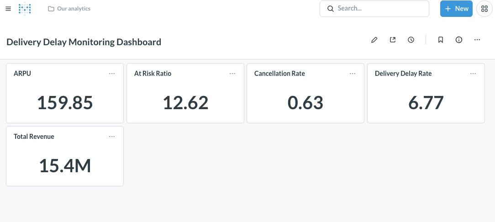

# 배송 지연이 고객 이탈과 매출 손실에 미치는 영향 분석

> 배송 지연이 고객 이탈과 매출 손실로 이어지는지를 데이터로 정량화한 프로젝트.  
> SQL·Python으로 가설을 검증하고 Metabase로 KPI를 모니터링하는 엔드투엔드 파이프라인을 구축했다.

**데이터**: Olist Brazilian E-Commerce (Kaggle, 2016–2018) 약 10만 주문  
**이벤트 로그**: 재구매 행동 시뮬레이션 320,759건 생성 (order_placed / order_delivered / review_submitted / repurchase)

---

## 목표

이커머스 운영에서 배송 지연이 발생할 때 어떤 비즈니스 손실이 생기는지를  
데이터로 정량화하고, 운영 리소스의 우선순위 결정에 활용할 수 있는 인사이트를 도출한다.

- 배송 지연 → 고객 이탈 위험 상승 경로를 가설 기반으로 검증
- 이탈 위험 고객의 잠재 매출 손실 규모 추정
- KPI 모니터링 대시보드로 지속적인 운영 관찰 가능하도록 구성

---

## 가설 및 검증 결과

| #   | 가설                                                                     | 결과    | 핵심 수치                           | p-value    |
| --- | ------------------------------------------------------------------------ | ------- | ----------------------------------- | ---------- |
| H1  | 지연 일수가 3일 이내면 이탈 위험 고객 비율에 유의미한 차이가 없을 것이다 | ❌ 기각 | on_time 9.14% vs slight 31.55%      | p < 0.0001 |
| H2  | 지연을 경험한 고객은 정시 배송 고객 대비 이탈 위험 비율이 높을 것이다    | ✅ 채택 | on_time 9.14% vs delayed 60.61%     | p < 0.0001 |
| H3  | 배송 지연으로 인한 예상 매출 손실은 전체 매출의 5% 이상일 것이다         | ❌ 기각 | loss_ratio 4.65%                    | —          |
| H4  | 배송 지연 일수가 길어질수록 주문 취소율이 단조롭게 증가할 것이다         | ❌ 기각 | Spearman r = −0.40, U자형 패턴 확인 | p = 0.5046 |

**핵심 발견**: 지연 주문의 저평점 비율은 정시 배송의 **6.6배** (60.61% vs 9.14%)

**비즈니스 시사점**: 배송 지연 감소와 고객 커뮤니케이션 개선이  
이탈률과 잠재 매출 손실을 줄이는 핵심 레버다.  
운영 리소스가 한정된 상황에서 지연 발생 초기(1~3일)부터  
개입하는 것이 효과적임을 데이터로 확인했다.

---

## 분석 설계 원칙

- **지연 판정**: `EXTRACT(DAY FROM (delivered_at - estimated_at))::INT > 0` (전 SQL 통일)
- **리뷰 중복 처리**: `MIN(review_score) + GROUP BY order_id` (전 SQL 통일)
- **저평점 기준**: 리뷰 점수 1~2점

---

## KPI 요약

| 지표                     | 값                |
| ------------------------ | ----------------- |
| 총 매출                  | 15,421,831.43 BRL |
| ARPU                     | 159.85 BRL        |
| 배송 지연율              | 6.77%             |
| At-Risk 고객 비율        | 12.62%            |
| 주문 취소율              | 0.63%             |
| 지연 주문 내 저평점 비율 | 60.61%            |

---

## 대시보드



KPI 지표(총 매출, 배송 지연율, at-risk 고객 비율 등)를
Metabase로 모니터링할 수 있도록 구성했다.

---

## 기술 스택

| 영역         | 기술                             |
| ------------ | -------------------------------- |
| 언어         | Python 3.12, SQL                 |
| 데이터베이스 | PostgreSQL 15                    |
| ETL          | SQLAlchemy, Pandas               |
| 통계 분석    | SciPy (Mann-Whitney U, Spearman) |
| 대시보드     | Metabase                         |
| 인프라       | Docker, Docker Compose           |

---

## 프로젝트 구조

```
├── notebooks/
│   ├── 01_eda.ipynb                  # 탐색적 데이터 분석
│   └── 02_hypothesis_testing.ipynb   # 가설 검증
├── sql/queries/
│   ├── h1_delay_threshold.sql
│   ├── h2_at_risk_comparison.sql
│   ├── h3_revenue_loss.sql
│   ├── h4_cancellation_rate.sql
│   ├── kpi.sql
│   └── validation.sql
├── etl/
│   ├── pipeline.py                   # 원천 데이터 추출·변환·적재 자동화
│   ├── extract.py
│   ├── transform.py
│   ├── load.py
│   ├── db.py
│   └── simulation/
│       └── generate_event_logs.py    # 재구매 추적 불가 문제를 이벤트 로그 시뮬레이션으로 보완
└── docker-compose.yml                # PostgreSQL + Metabase
```

---

## 실행 방법

**1. 환경 변수 설정**

```bash
cp .env.example .env
# 필요 시 `.env` 값을 수정하세요.
```

**2. 컨테이너 실행**

```bash
docker compose up -d
# PostgreSQL → localhost:${POSTGRES_PORT}
# Metabase   → http://localhost:3000
```

**3. ETL 파이프라인 실행**

```bash
pip install -r requirements.txt
python -m etl.pipeline
python -m etl.simulation.generate_event_logs
```

**4. 가설 검증 SQL 실행**

DBeaver 등 SQL 클라이언트에서 `sql/queries/` 내 파일을 열어 실행하거나  
`.env` 설정값을 입력해 아래 명령어로 확인할 수 있습니다:

```bash
psql -h localhost -p 5432 -U your_user -d your_db \
  -f sql/queries/h2_at_risk_comparison.sql
```

---

## 라이선스

데이터: [Brazilian E-Commerce Public Dataset by Olist](https://www.kaggle.com/datasets/olistbr/brazilian-ecommerce) — CC BY-NC-SA 4.0
